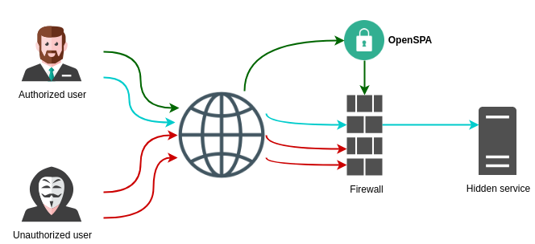

# OpenSPA
OpenSPA: An open and extensible Single Packet Authorization (SPA) implementation of the [OpenSPA Protocol](https://github.com/greenstatic/openspa-protocol).

**This software is under heavy development. No guarantees are made that it will remain backwards compatible in it's current form. 
We WILL break it during development. 
You have been warned.**
Don't worry, we are always happy to get contributors. If you are interesting do get in touch: hello[at]openspa[dot]org.

## What is OpenSPA?
OpenSPA is an open and extensible SPA implementation built upon the [OpenSPA Protocol](https://github.com/greenstatic/openspa-protocol).
OpenSPA allows the deployment of a service on an internal network or the internet, that is hidden to all unauthorized users.
Authorized users authenticate by sending a single packet to the OpenSPA server, which will reveal itself only if the user is authorized to access the service.

OpenSPA builds what essentially is a dynamic firewall.



Unauthorized users will not be able to detect via the network the presence of the hidden service (no ping, traceroute, port scans, fingerprinting, etc.).
Once the user sends an OpenSPA request packet (via UDP) and they are authorized only then will the server respond with a response.
Unauthorized users thus will also be unable to confirm the existence of the OpenSPA service.


### Vocabulary, To Avoid Confusion
* OpenSPA - Refers to the concept of SPA implemented by the *OpenSPA Protocol* and reference implementation of the client and server (*OpenSPA Client* and *OpenSPA Server* respectively).
* [OpenSPA Protocol](https://github.com/greenstatic/openspa-protocol) - The protocol specification used by all OpenSPA supported clients and servers.
* OpenSPA Server - Refers to the reference implementation of an *OpenSPA enabled server application*.
* OpenSPA Client - Refers to the reference implementation of an *OpenSPA enabled client application*.
* [openspalib](https://github.com/greenstatic/openspalib) - The reference implementation of a Golang library that implements the *OpenSPA Protocol*.
* [OpenSPA Extension Scripts](https://github.com/greenstatic/openspa-extension-scripts) - A technique used by the *OpenSPA Server* (reference implementation) on how to enable open and extensible support.
* OSPA - A client configuration file format that contains all the necessary details to authenticate with an *OpenSPA Server*. Used by the *OpenSPA Client*
* OpenSPA Tools - A small CLI tool application which is useful for *OpenSPA Server* administrators. Used for generating OSPA files.
* [Echo-IP](https://github.com/greenstatic/echo-ip) - A small service responsible for responding with the requester's public IP.

## OpenSPA: The Implementation
OpenSPA is composed of the *OpenSPA client* and the *OpenSPA server*.
Both implementations are written in Golang.
During development the application is being tested under Ubuntu (GNU/Linux) and MacOS. 
Even though we made sure to use generic function calls we cannot vouch yet for Windows support.

### OpenSPA Client
The client comes bundled as a CLI application.
It supports the following features:
* Alpha 1.0.0 OpenSPA protocol specification
* Automatic public IP resolution using [Echo-IP](https://github.com/greenstatic/echo-ip)
* OSPA file support
* IPv4/IPv6 support

#### OSPA File
The OSPA file format is a normal YAML file with predefined fields.
The file contains all the necessary details to connect to a service.
The idea is that each OpenSPA Server gives their client an OSPA file with which they can connect seamlessly to the server. 


### OpenSPA Server
The server comes bundled as a CLI application as well.

The server uses the [openspalib](https://github.com/greenstatic/openspalib) library to consume the packets defined by the [OpenSPA protocol specification](https://github.com/greenstatic/openspa-protocol).

The server supports the following features:
* Alpha 1.0.0 OpenSPA protocol specification
* User programmable public key lookup
* User programmable authorization mechanism
* User programmable firewall mechanism
* IPv4/IPv6 support

A tutorial is available how to setup [OpenSPA Server with iptables](docs/OpenSPA%20Server%20Installation%20with%20iptables.md) on a Debian based system.

### OpenSPA Tools
OpenSPA Tools is a small CLI utility that implements various tools to help *OpenSPA Server* administrators.

The tools CLI supports the following features:
* Generation of OSPA file's

### Getting the Software
Currently, since the entire project is under alpha we do not provide compiled binaries.
So you will have to compile it yourself.
Don't worry it's super simple.

1. First install the Go tools (so you can compile Go programs). [Here](https://golang.org/doc/install) are some useful instructions.
2. Open the terminal and move your working directory to the required program you wish to compile (one of the ones bellow)
    * `cd cmd/openspa-client`
    * `cd cmd/openspa-server`
    * `cd cmd/openspa-tools`
3. Once inside the directory get all the dependencies: `go get -u ./...`
4. Build the program: `go build .`
5. That's it! Inside your working directory should be the compiled binary.

Note: the build you create will work only for the platform you are building under. To build for other platforms check the documentation for the `GOOS` and `GOARCH` environment variables. It's **super** simple.


## Development
### Dependencies
Install all dependencies by cd-ing into the repository root and running:
```bash
go get -u ./...
```

## TODO
- [ ] Implement packet replay detection
- [ ] Improve the firewalltracker package
- [ ] OpenSPA Client support for encrypted private keys
- [ ] OpenSPA Server public IP resolver
- [ ] OpenSPA Server support for extension scripts to cleanup firewall before/after server startup

## License
The OpenSPA Client, OpenSPA Server and OpenSPA Tools are released under the [LGPLv3](https://www.gnu.org/licenses/lgpl-3.0.en.html) license.